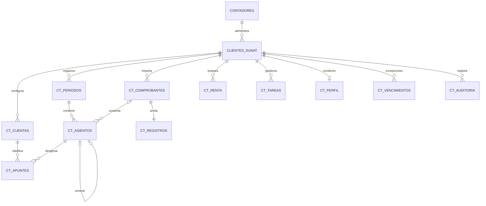

# Modelo entidad-relación

La implementación conserva Node.js/Express y SQLite. Cada **contador es un tenant**
y cada cliente SUNAT una empresa. El diseño inicial PostgreSQL entregado en el chat
era una propuesta independiente; este modelo corresponde al código real integrado.



**DDL ejecutable:** [schema.sql](../modules/contabilidad/schema.sql). Se aplica en
una transacción al iniciar `db.js`. Requiere las tablas existentes `contadores` y
`clientes_sunat`. Es aditivo y repetible. Habilita claves foráneas; la eliminación de
clientes o contadores con expediente contable queda bloqueada para conservarlo.

Las tablas contables llevan `contador_id` y `cliente_id`; sus relaciones usan ambas
columnas. Las consultas reciben el contador desde la sesión, nunca desde el cuerpo
de la petición. SQLite no tiene RLS: la autorización se aplica en la API y en el
servicio, reforzada por claves compuestas. El archivo de base de datos se mantiene
fuera del directorio público. No conectar usuarios finales directamente a SQLite.

## Backend implementado

Monolito modular con separación de dominio, aplicación y transporte:

```text
modules/contabilidad/
  schema.sql        DDL, restricciones, inmutabilidad y vista ct_mayor
  money.js          Céntimos enteros, redondeo racional, fechas y periodos
  parser.js         Ingesta UBL 2.1 y observaciones
  service.js        Importación, propuestas, aprobación, informes y renta
  sire.js           Adaptadores preliminares RVIE/RCE con perfil delimitado
  crm.js            Calendario mensual y tareas por empresa
  import-folder.js  Adaptador al descargador local existente
  routes.js         REST, sesión activa, CSRF y autorización
public/contabilidad.js, contabilidad.css
views/contabilidad.html
tests/              Dominio, base de datos, API y recorrido en navegador
```

No se introdujo un segundo backend en Python/C#: el programa ya usa JavaScript y
`fast-xml-parser`. El parser es un módulo independiente que puede sustituirse
mediante un adaptador si más adelante se separa la ingesta en otro servicio.

Rutas bajo `/api/contabilidad/clientes/:id`:

| Ruta | Operación |
|---|---|
| `POST /xml` | XML como `application/xml`, máximo 2 MB |
| `GET /comprobantes` | Documentos y observaciones |
| `POST /comprobantes/:doc/proponer` | Cuenta de naturaleza + decisión de crédito fiscal |
| `GET, POST /asientos` | Consultar o crear asiento manual |
| `PUT /asientos/:id` | Editar apuntes del borrador |
| `POST /asientos/:id/contabilizar` | Aprobar en transacción |
| `POST /asientos/:id/revertir` | Crear reversión como borrador |
| `GET /mayor?corte=AAAA-MM-DD` | Mayor acumulado por cuenta |
| `GET /estados?corte=AAAA-MM-DD` | Balance de comprobación, situación y resultados |
| `GET /registros?periodo=AAAA-MM` | Ventas/compras por anotación |
| `PUT /registros/:doc` | Periodo, revisión fiscal y estado SUNAT verificado por contador |
| `POST /sire` | Archivo preliminar y versión; no envía a SUNAT |
| `GET, POST /renta` | Historial / cálculo del borrador anual |
| `POST /tareas`, `PUT /tareas/:id` | Seguimiento y cierre de tareas |
| `PUT /perfil`, `PUT /vencimiento` | Condición tributaria y excepción sustentada |
| `GET, POST /periodos` | Consulta, cierre y reapertura auditada |
| `GET, POST /cuentas` | Plan inicial y nuevas cuentas imputables |
| `GET /auditoria`, `GET /exportar` | Historial y papeles de trabajo CSV |

`GET /api/contabilidad/csrf` entrega el token de sesión; las mutaciones requieren
`X-CSRF-Token`. `GET /api/contabilidad/crm?periodo=AAAA-MM` reúne únicamente los
clientes del contador autenticado.

## Flujo XML → partida doble

1. Rechaza XML mal formado, DTD/entidades, namespace incorrecto y versiones ajenas
   a UBL 2.1. Resuelve por URI los prefijos CBC/CAC; no supone que se llamen igual.
2. Extrae identificaciones, fecha, moneda, líneas, bases, impuestos y referencias.
   Determina compra o venta comparando el RUC del cliente con emisor y receptor.
3. Conserva XML, datos normalizados y SHA-256 del texto importado. La clave fiscal
   evita repetir importaciones; cambios de contenido con la misma clave generan
   conflicto, nunca sobreescritura silenciosa.
4. Los casos simples PEN admiten propuesta después de elegir cuenta y tratamiento
   del IGV. Los casos especiales quedan observados. No asigna todo gasto a una
   cuenta automáticamente ni presume derecho a crédito fiscal.
5. Una nota exige el original del mismo emisor, receptor y moneda y una fecha
   compatible. La nota de crédito invierte los lados; la nota de débito conserva
   el sentido. El contador debe revisar motivo, importes acumulados y naturaleza.
6. Contabilizar exige periodo abierto, al menos dos apuntes y debe = haber. Una
   transacción de escritura SQLite serializa los cambios. Los triggers
   impiden cambiar o borrar asientos contabilizados y sus apuntes. Las correcciones
   se hacen mediante reversión; el nuevo asiento también debe aprobarse.

Ejemplo de venta de mercadería al crédito, S/ 100 + IGV S/ 18:

| Cuenta | Debe | Haber |
|---|---:|---:|
| 1212 Facturas en cartera | 118.00 | 0.00 |
| 70111 Mercaderías a terceros | 0.00 | 100.00 |
| 40111 IGV | 0.00 | 18.00 |

Una nota de crédito por toda la operación propone exactamente los lados contrarios.
Para una compra de servicios con IGV utilizable: debe 6399 por 100, debe 40111 por
18 y haber 4212 por 118. Sin crédito fiscal, el cargo a gasto incorpora el IGV.
La selección del ejemplo no reemplaza la clasificación profesional de cada operación.
Compras de mercadería requieren los destinos/variaciones de existencias que
correspondan; el costo de ventas se registra con información de inventario.

## Mayor y estados financieros: matemática y SQL

El Mayor es la vista `ct_mayor`: nunca se mantiene una copia independiente del Diario.
Para cuenta `c` y corte `T`, saldo deudor = Σ(debe − haber) hasta T. Incluye apertura
y movimientos de ejercicios anteriores. El estado de resultados toma solo las
operaciones del ejercicio: excluye asientos marcados como apertura o cierre.

```sql
SELECT cuenta, SUM(debe) AS debe, SUM(haber) AS haber,
       SUM(debe-haber) AS saldo_deudor
FROM ct_mayor
WHERE contador_id = :contador AND cliente_id = :cliente AND fecha <= :corte
GROUP BY cuenta;

SELECT c.clase, c.rubro,
       SUM(CASE WHEN c.clase='ingreso' THEN m.haber-m.debe
                ELSE m.debe-m.haber END) AS importe_centimos
FROM ct_mayor m JOIN ct_cuentas c
 ON c.contador_id=m.contador_id AND c.cliente_id=m.cliente_id AND c.codigo=m.cuenta
WHERE m.contador_id=:contador AND m.cliente_id=:cliente
  AND m.fecha BETWEEN :inicio_ejercicio AND :corte AND m.clase='operacion'
  AND c.clase IN ('ingreso','gasto')
GROUP BY c.clase,c.rubro;
```

Situación financiera: activos con signo deudor; pasivos/patrimonio con signo acreedor.
La implementación reclasifica 40111 deudor como crédito fiscal dentro del activo.
El resto de rubros y cuentas correctoras se configura según el plan del cliente;
no toma el valor absoluto de saldos negativos. Las reclasificaciones adicionales
y corriente/no corriente requieren cuentas/rubros y ajustes del contador.

Control: Activo − Pasivo − Patrimonio registrado − Resultado pendiente de cierre = 0.
La utilidad pendiente se obtiene del saldo aún no cerrado de cuentas de ingresos y
gastos; no se suma por segunda vez un resultado ya transferido al patrimonio.

Ejemplo: activo 50,000, pasivo 20,000, patrimonio registrado 25,000 y resultado
pendiente 5,000 → diferencia cero. El balance de comprobación expone los importes
por cuenta para identificar errores de clasificación aunque la partida doble cuadre.

## Renta anual y CRM

Renta preliminar = utilidad contable antes de impuesto + adiciones − deducciones.
Se suma de vuelta el gasto registrado en cuentas 88 para partir de un resultado
antes de impuesto. Base = máximo(0, renta preliminar − pérdidas compensables validadas).
Se aplican las reglas base RG 29.5%; RMT 10% hasta 15 UIT y 29.5% al exceso.
El contador introduce UIT y fuente del ejercicio y verifica vigencia, régimen,
límites y sistema de pérdidas. Cada ajuste requiere concepto/fundamento. El saldo
resta pagos a cuenta y otros créditos; un saldo negativo representa saldo a favor.
Se guarda el último borrador por ejercicio con parámetros y auditoría de cálculo.

Cronograma: snapshot oficial mensual 2026, todos los dígitos del RUC y buenos
contribuyentes/UESP; diciembre vence en enero de 2027. Para otros años se muestra
“sin cronograma”, sin inventar fechas. Se admiten excepciones por cliente/periodo
con URL oficial y motivo. Las alertas se calculan al cargar el panel, en hora de
Lima; no hay envío de correos ni notificaciones externas. No incluye cronograma
de renta anual ni el cronograma específico de atraso de libros electrónicos.

## SIRE: alcance verificable

Genera TXT preliminares delimitados por `|`: RVIE anexo 3 base (33 campos) y RCE
anexo 11 base (37 campos), sin campos opcionales de libre utilización. Es un
adaptador inicial basado en las fuentes indicadas, **no una certificación de
compatibilidad normativa vigente ni una presentación electrónica**.

Admite documentos 01/03/07/08 simples en PEN, IGV/exonerado/inafecto, una referencia
por nota, clasificación de compras y decisión DG/DNG sin prorrata. Las notas de
crédito de ventas con original de periodos anteriores usan columnas de descuento.
El RCE exige aceptación y clasificación de bienes/servicios; bloquea operaciones
especiales y revisiones incompletas. El exportador no omite silenciosamente filas
observadas. No deduce operaciones “sin movimiento” de una importación vacía.

Antes del uso fiscal: confirmar razón social legal, conciliar todos los documentos
con la propuesta SUNAT, verificar modificatorias y reglas aplicables, nombre/codificación
de archivo y validar con PVSIRE. Faltan integración API SIRE, tickets, constancias,
validación de CDR/firma, ajustes posteriores, no domiciliados, detracciones/retenciones,
prorrata, exportaciones, anticipos y otros perfiles especiales. El CSV está rotulado
como papel de trabajo y no se presenta como archivo oficial.

## Operación y pruebas

1. Respaldar `data/contafacil.db` antes de actualizar (con el servidor detenido o con
   una copia consistente que incluya WAL). Mantener las claves existentes de `.env`.
2. Ejecutar `npm ci` y `npm start`. Abrir `/contabilidad` desde el menú o un cliente.
3. Importar los XML. También existe una casilla opcional en descargas para importar
   al terminar los XML UTF-8 de la carpeta autorizada. Omite enlaces y limita tamaño,
   profundidad y cantidad; informa errores por archivo. No contabiliza automáticamente.
4. Elegir cuenta/IGV, revisar borradores, contabilizar y consultar libros/estados.
5. Añadir apertura, operaciones ajenas a XML y ajustes antes del cierre/reportes finales.

`npm test`: pruebas de dominio, SQL, SIRE, autenticación, CSRF y aislamiento HTTP.
`npm run test:browser`: prueba de extremo a extremo con Microsoft Edge instalado,
base desechable y documentos sintéticos. Nunca usa credenciales SOL reales.

La base funcional conserva SQLite y las sesiones locales existentes. Un despliegue
SaaS distribuido requiere PostgreSQL con aislamiento equivalente y migraciones,
almacén de sesiones compartido, cola de ingesta, autorización de miembros por estudio,
backups/restauración, monitorización y validación con casos reales anonimizados.
No implementa aún flujo de efectivo, cambios en patrimonio, notas a los estados,
inventario/kardex, bancos, activos fijos ni nóminas como submódulos automáticos.

## Fuentes oficiales consultadas

- [PCGE modificado 2019, MEF](https://www.mef.gob.pe/contenidos/conta_publ/pcge/PCGE_2019.pdf).
- [Guías UBL 2.1, SUNAT](https://cpe.sunat.gob.pe/guias-y-manuales).
- [Estructuras SIRE](https://cpe.sunat.gob.pe/estructura-de-archivos).
- [Anexo 3 RVIE, RS 112-2021](https://www.sunat.gob.pe/legislacion/superin/2021/anexo-112-2021.pdf).
- [Anexo 11 RCE, RS 040-2022](https://www.sunat.gob.pe/legislacion/superin/2022/anexo-040-2022.pdf).
- [Tasas de renta](https://renta.sunat.gob.pe/empresas/tasas-de-impuesto).
- [Cronograma mensual 2026](https://www.sunat.gob.pe/orientacion/cronogramas/2026/cObligacionMensual2026.html).
