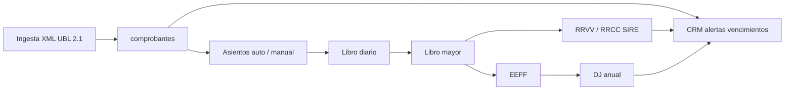
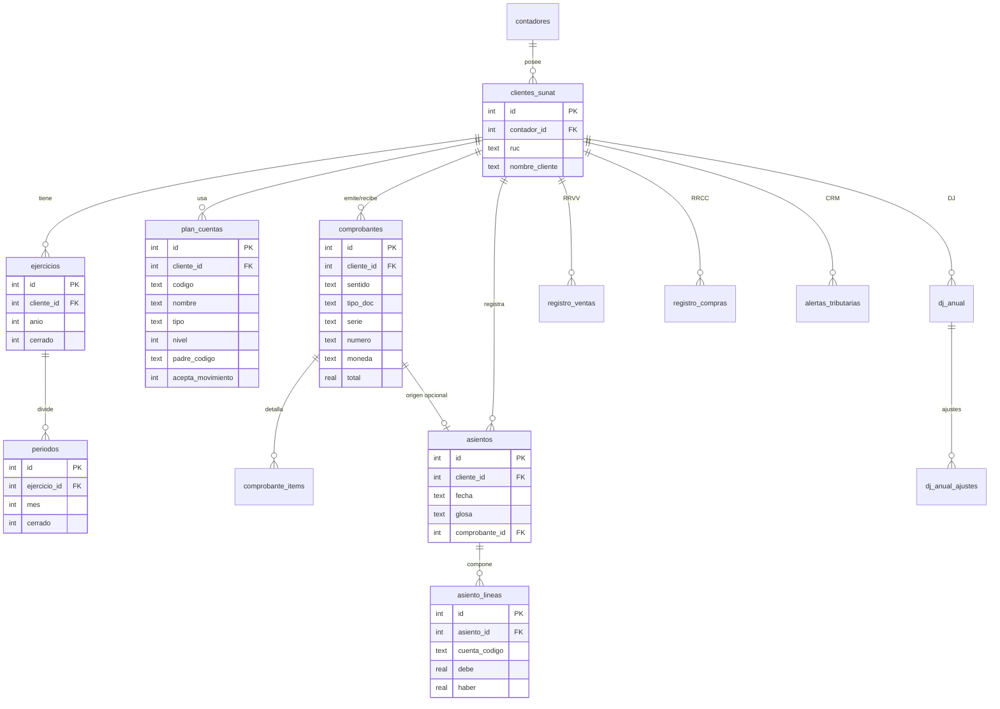

# Núcleo contable ContaFácil — Modelo y arquitectura

Documento de diseño del esquema contable multi-empresa sobre SQLite (`better-sqlite3`).  
**Alcance de este entregable:** esquema SQL + modelo ER + roadmap. No incluye parser UBL, UI ni servicios de asiento automático.

---

## 1. Arquitectura multi-tenant (local)

ContaFácil no es un SaaS C# multi-tenant clásico. Es una app **Node/Express local** con una sola base SQLite (`data/contafacil.db`).

| Capa | Tabla existente | Rol |
|------|-----------------|-----|
| Usuario contador | `contadores` | Login, bloqueos, términos |
| Empresa / tenant | `clientes_sunat` | Cliente del contador (RUC + SOL). **Es el tenant contable** |
| Admin | `admin_seguridad` | Bloqueo del login administrador |

**Regla de aislamiento:** todo registro contable nuevo lleva `cliente_id` (= `clientes_sunat.id`). Un contador ve solo sus clientes; dentro de un cliente, todos los libros, asientos y registros se filtran por ese `cliente_id`.

```
contadores (1) ──< (N) clientes_sunat ──< (N) ejercicios / plan_cuentas / comprobantes / asientos / …
```

Las tablas actuales (`contadores`, `clientes_sunat`, `admin_seguridad`) **no se modifican** en estructura obligatoria; el núcleo contable se agrega con `CREATE TABLE IF NOT EXISTS`.

---

## 2. Mapa de módulos (flujo de datos)



| Módulo | Entrada | Salida / tablas |
|--------|---------|-----------------|
| Ingesta XML | ZIP/XML SUNAT o carga manual | `comprobantes`, `comprobante_items` |
| Diario | Comprobante o captura manual | `asientos`, `asiento_lineas` |
| Mayor | Líneas de asiento | Vista `v_libro_mayor` |
| Registros | Posting desde comprobantes | `registro_ventas`, `registro_compras` |
| EEFF | Saldos de cuentas | Reportes (Fase 3; sin tablas dedicadas aún) |
| DJ anual | Ajustes tributarios | `dj_anual`, `dj_anual_ajustes` (stubs) |
| CRM | Calendario tributario + dígito RUC | `alertas_tributarias` |

---

## 3. Diagrama entidad-relación



---

## 4. Tablas del núcleo (resumen)

| Tabla | Propósito |
|-------|-----------|
| `ejercicios` | Año fiscal por empresa (`cliente_id`, `anio`, `cerrado`) |
| `periodos` | Meses del ejercicio (`mes` 1–12, `cerrado`) |
| `plan_cuentas` | PCGE: `cliente_id` NULL = plantilla global; al activar empresa se puede copiar |
| `comprobantes` | Cabecera UBL 2.1 (emitida/recibida), montos, XML path/hash |
| `comprobante_items` | Líneas opcionales del comprobante |
| `asientos` | Libro diario |
| `asiento_lineas` | Partidas debe/haber (partida doble validada en app) |
| `registro_ventas` | RRVV orientado a SIRE (llenado por servicio de posting) |
| `registro_compras` | RRCC orientado a SIRE |
| `alertas_tributarias` | CRM de vencimientos (IGV, PDT, etc.) |
| `dj_anual` / `dj_anual_ajustes` | Stubs DJ anual (adiciones/deducciones) |

Vistas útiles: `v_libro_mayor`, `v_balance_comprobacion` (esqueleto).

DDL completo: [`sql/schema-contable.sql`](../sql/schema-contable.sql).  
Semilla PCGE mínima: [`sql/seed-pcge.sql`](../sql/seed-pcge.sql).

---

## 5. Reglas de mapeo contable (propuesta)

Convención de sentido en `comprobantes.sentido`:

- **`emitida`**: venta / egreso de documentos propios.
- **`recibida`**: compra / documento de tercero.

### Factura / boleta emitida (venta gravada, ejemplo)

| Cuenta | Debe | Haber | Nota |
|--------|------|-------|------|
| 12x Cuentas por cobrar / 10x Caja-banco | Total | | Según cobranza |
| 701 / 702 Ventas | | Base gravada | Según rubro |
| 4011 IGV | | IGV | Débito fiscal |

### Factura recibida (compra gravada, ejemplo)

| Cuenta | Debe | Haber | Nota |
|--------|------|-------|------|
| 60 / 63 Compras / servicios | Base | | Según naturaleza |
| 4011 IGV (crédito fiscal) | IGV | | Si da derecho a crédito |
| 42x Cuentas por pagar | | Total | |

> Estas reglas son **propuesta de diseño** para el futuro servicio de asiento automático (`origen = auto_xml`). El contador podrá ajustar plantillas por cliente. La partida doble (`SUM(debe) = SUM(haber)` por asiento) se valida en la capa de aplicación, no solo en SQLite.

---

## 6. Roadmap por fases

| Fase | Entrega | Dependencias |
|------|---------|--------------|
| **Fase 1** | Parser UBL → `comprobantes` + libro diario (`asientos` / `asiento_lineas`) | Schema + seed PCGE |
| **Fase 2** | Mayor + `registro_ventas` / `registro_compras` (SIRE) | Fase 1 |
| **Fase 3** | Estados financieros (Balance, PyG) desde saldos | Fase 2 + plan completo |
| **Fase 4** | DJ anual (`dj_anual` + ajustes) | Fase 3 |
| **Fase 5** | CRM vencimientos (`alertas_tributarias`) | Calendario + dígito RUC |

**Siguiente construcción recomendada:** Fase 1 — ingesta XML + generación de asientos con las reglas de mapeo anteriores.

---

## 7. Archivos relacionados

- `sql/schema-contable.sql` — DDL + índices + vistas  
- `sql/seed-pcge.sql` — cuentas PCGE mínimas (plantilla global)  
- `db.js` — al arrancar ejecuta el schema (y seed) si los archivos existen  

---

*ContaFácil — núcleo contable. Documento vivo; ajustar con reglas SUNAT/SIRE al implementar posting.*
